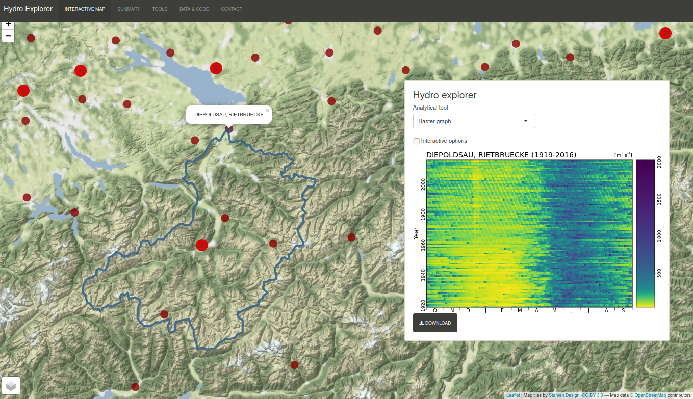

# Summary 

Climatic changes and anthropogenic modifications of the river network or basin have the potential to fundamentally alter river runoff. In the framework of this study, we investigate historic changes in runoff seasonality and runoff timing observed at gauging stations all over the world. In this regard, we develop the 'Hydro Explorer', an interactive shiny web app, which enables the investigation of more than 7000 time series. The available selection of tools inter alia enables the analysis of changes in mean annual cycles, inter- and intra-annual variability, the timing and magnitude of annual maxima and changes in quantile values over time. The interactive nature of the developed web app allows a quick comparison of gauges, regions, methods and times frames and makes it possible to assess weaknesses and strenghts of individual analytical tools.

Web Application:  http://natriskchange.ad.umwelt.uni-potsdam.de:3838/HydroExplorer/

Source Code: https://github.com/ERottler/meltimr

# Hydro Explorer

Key component of the shiny web app is an interactive leaflet map [@shiny2019; @leaflet2018]. On click, observations of the selected gauging station are displayed in the draggable viewer panel. Via a dropdown menu, different analytical tools can be selected. A short description of available tools and interactive options can be found in the tab 'TOOLS'. The dropdown menu for selecting analytical tools also contains the option to filter stations displayed on the map. Selections can be made according to data coverage and location. Using the layer control on the bottom left of the map, different basemaps can be selected and watershed boundaries displayed. Figures can be downloaded clicking the download button below the graph displayed.

# Data

In the framework of this study, we focus on daily discharge data from the global runoff dataset provided by the Global Runoff Data Centre 56068 Koblenz, Germany (GRDC). This unique collection of discharge time series from all over the world represents a key dataset for hydrological research. Watershed boundaries were derived by Bernhard Lehner based on the HydroSHEDS drainage network [@lehner2011]. 

# Target audience

The Hydro Explorer targets researchers working in the field of environmetal science. Particularly hydrologists investigating changes in river runoff, who now can explore a global data set in an interactive way, might be interested. Furthermore, (son-to-be) users of the GRDC data base can easily explore available time series. The app also can be used for teaching purposes, in order to illustrate the variaty of river runoff regimes and factors causing changes in river runoff. 

# Funding

This research was funded by Deutsche Forschungsgemeinschaft (DFG) within the graduate research training group NatRiskChange (GRK 2043/1) at the University of Potsdam: https://www.uni-potsdam.de/en/natriskchange

# References
